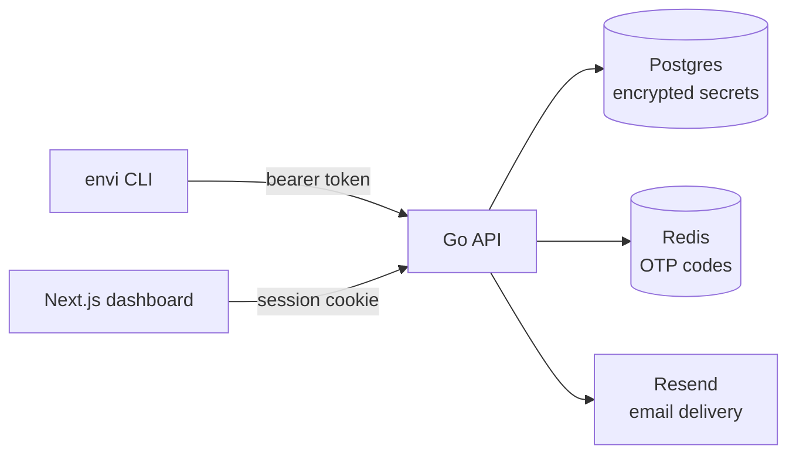

  <picture>
    <source media="(prefers-color-scheme: dark)" srcset="ui/public/envi-logo-with-text-dark-mode.png">
    
  </picture>

<strong>Environment secrets, encrypted, scoped, and audited — as a hosted product, or run entirely on your own infrastructure.</strong>

  
  
  
  

---

**Envi** is an environment-secret manager: encrypted `.env` values, scoped access, an audit trail, and a CLI that gets a secret from your database into a running process without anyone typing it into Slack. Envi is built and run as a product — this repository is also the entire self-hostable stack, for teams who'd rather keep everything on infrastructure they control.

## What it does

- **Encrypted at rest** — every secret is sealed with AES-256-GCM before it touches Postgres. Nothing is ever stored in plaintext, including in the version history kept for every change.
- **Scoped access** — grant a collaborator `read`, `write`, or `manage` on a project or a single environment. Production doesn't get touched by accident.
- **Passwordless auth** — sign in with a one-time email code or approve a device from your browser. No passwords exist anywhere in the system to leak.
- **Service tokens** — long-lived, scoped credentials for CI/CD pipelines and deploy scripts, independent of any human's session.
- **Full audit trail** — every read, write, and delete is logged against the org, the actor, and the exact secret touched.
- **Email invitations** — invite a teammate by address; they click through, sign in (or sign up on the spot if they're new), and land with access already waiting.
- **CLI and dashboard, one API** — `envi pull`/`push`/`diff` your `.env` files from the terminal, or manage everything visually. Same backend, same permissions, your choice of interface.

## How it fits together

The CLI and the web dashboard are two clients of the same API — neither one is a special case. Secrets are encrypted before they reach Postgres and decrypted only in memory, on demand, for a request that's already passed the access-grant check.

## Security, briefly

- Secret values: AES-256-GCM, one key, sealed before every write.
- Tokens: access, refresh, service, and invitation tokens are all stored as salted hashes — the plaintext exists only once, at issuance, in the response the caller already has.
- Sessions: HMAC-signed, HTTP-only, `SameSite=Strict` cookies on the web; rotating refresh tokens everywhere.
- Rate limits: OTP requests and attempts are capped; invitations are capped per sender, so a compromised account can't be used to blast a domain's sending reputation.

## The CLI

| Command | What it does |
|---|---|
| `envi auth` | Sign in — browser device flow by default, `--email` for a one-time code instead |
| `envi init` | Link the current directory to a project and environment |
| `envi pull` | Write the environment's secrets to `.env` |
| `envi push` | Send local `.env` changes up, with optimistic-concurrency conflict detection |
| `envi diff` | Show what's changed between local and remote before you push |
| `envi project create <name>` | Create a project |
| `envi env create <name>` | Create an environment under the current project |
| `envi share <email>` | Invite a collaborator with scoped access |
| `envi invite accept <token>` | Accept an invitation |
| `envi token create --name <name>` | Mint a scoped service token for CI/CD |
| `envi activity` | Recent reads and writes across your org |
| `envi logout` | Revoke the current session |

## Running it yourself

Envi is offered as a hosted product, and this repository is also the complete stack behind it — nothing is held back for a separate "enterprise" self-hosted build. Running your own instance means running four things:

- **Postgres** — the source of truth for everything: projects, environments, encrypted secrets, access grants, audit events.
- **Redis** — short-lived state only: OTP codes and rate-limit counters.
- **The API** (`cmd/api`) — a single Go binary, stateless, talking to both.
- **The web dashboard** (`ui/`) — a Next.js app that proxies to the API; the CLI talks to the API directly and doesn't need this at all.

Outbound email (OTP codes, invitations) goes through [Resend](https://resend.com) — bring your own API key and a verified sending domain.

A full deployment walkthrough is coming; for now, treat this as the shape of the system rather than a step-by-step.

## License

MIT — see [LICENSE](LICENSE).
