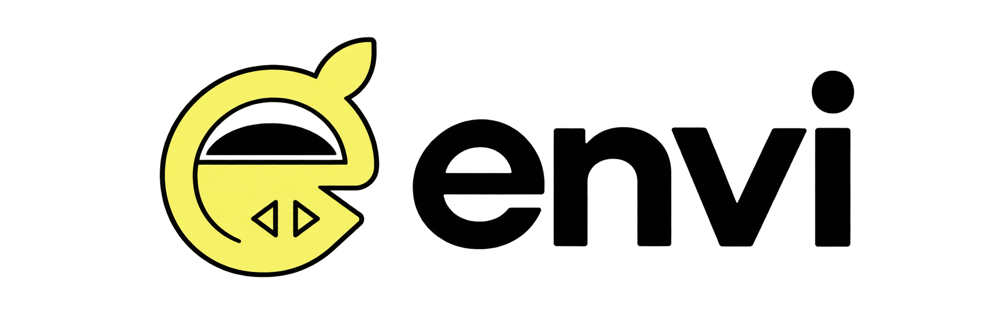
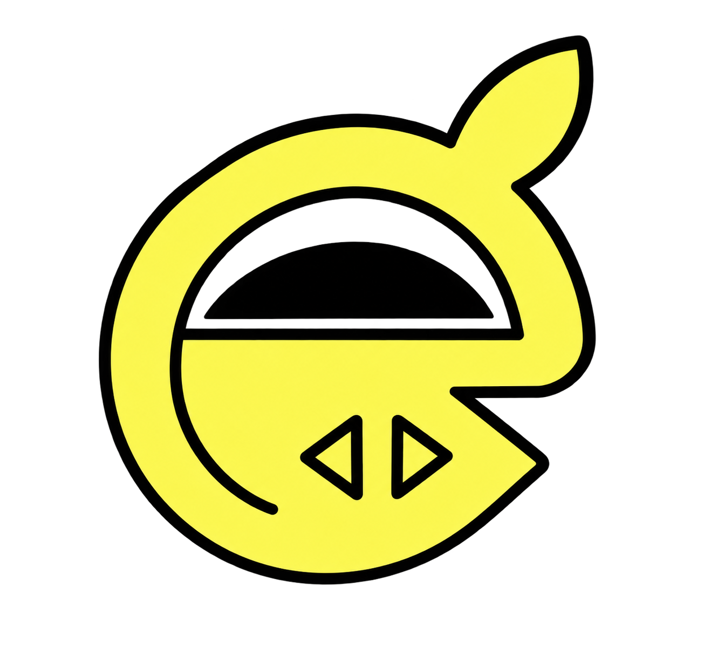
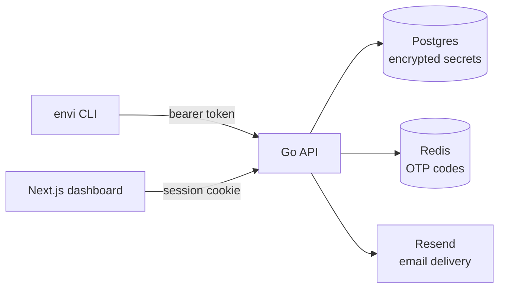

<p align="center">
  <picture>
    <source media="(prefers-color-scheme: dark)" srcset="ui/public/envi-logo-with-text-dark-mode.png">
    
  </picture>
</p>

<p align="center"><strong>Environment secrets, encrypted, scoped, and audited — as a hosted product, or run entirely on your own infrastructure.</strong></p>

<p align="center">
  
  
  
  
  
</p>

---



**Envi** is an environment-secret manager: encrypted `.env` values, scoped access, an audit trail, and a CLI that gets a secret from your database into a running process without anyone typing it into Slack. Envi is built and run as a product — this repository is also the entire self-hostable stack, for teams who'd rather keep everything on infrastructure they control.

Full documentation: **[docs.envisecrets.com](https://docs.envisecrets.com)**

## Install the CLI

```bash
curl -fsSL https://install.envisecrets.com | sh
```

```powershell
irm https://install.envisecrets.com/install.ps1 | iex
```

The script detects your OS and CPU architecture, verifies a SHA-256 checksum before installing, and works on macOS, Linux, Termux, and Windows.

## What it does

- **Encrypted at rest** — every secret is sealed with AES-256-GCM before it touches Postgres. Nothing is ever stored in plaintext, including in the version history kept for every change.
- **Scoped access** — grant a collaborator `read`, `write`, or `manage` on a project or a single environment. Production doesn't get touched by accident.
- **Passwordless auth** — sign in with a one-time email code or approve a device from your browser. No passwords exist anywhere in the system to leak.
- **Service tokens** — long-lived, scoped credentials for CI/CD pipelines and deploy scripts, independent of any human's session.
- **Multiple environments** — dev, staging, prod as separate sets of secrets in one project. `envi origin switch prod` repoints your working directory; `envi push .env origin prod` writes to one you aren't on.
- **No `.env` on disk** — `envi run -- npm start` injects secrets into the process that needs them and exits with that process's own status. Nothing plaintext is written to your filesystem.
- **Runtime SDK** — `@shellhaki/envi-sdk` reads your secrets from code on platforms where you don't control the process, like Vercel, Lambda and Cloudflare Workers.
- **Full audit trail** — every write and delete is logged against the org, the actor, and the exact secret touched. Reads are logged once per environment with the number of secrets they covered, so a command you run all day stays readable in the feed.
- **Email invitations** — invite a teammate by address; they click through, sign in (or sign up on the spot if they're new), and land with access already waiting.
- **CLI and dashboard, one API** — `envi pull`/`push`/`diff` your `.env` files from the terminal, or manage everything visually. Same backend, same permissions, your choice of interface.

## Self-host it in one command

```bash
git clone https://github.com/shellhaki/envi.git
cd envi
cp .env.example .env     # fill in the four required values
docker compose up -d
```

That brings up Postgres, Redis, the API, the install-script server, and the dashboard together. The database schema is applied automatically on first start. The dashboard lands on [localhost:3000](http://localhost:3000).

You need four values in `.env` before it will start:

| Variable | What it is |
|---|---|
| `ENVI_ENCRYPTION_KEY` | Exactly 32 characters — `openssl rand -hex 16`. Decrypts every secret you store. |
| `ENVI_SESSION_SECRET` | At least 32 characters — signs dashboard session cookies. |
| `RESEND_API_KEY` | For one-time sign-in codes and invitations. |
| `RESEND_FROM` | Sender address, on a domain verified with Resend. |

Prefer running the binaries directly under a process manager instead? See the [deployment walkthrough](https://docs.envisecrets.com/self-hosting/deployment).

## How it fits together



The CLI and the dashboard are two clients of the same API — neither one is a special case. Secrets are encrypted before they reach Postgres and decrypted only in memory, on demand, for a request that has already passed the access-grant check.

## Repository layout

| Path | What it is |
|---|---|
| `cmd/api` | The API server — the entire backend |
| `cmd/envi` | The CLI, released for macOS, Linux, Termux, and Windows |
| `cmd/install` | Tiny server for the `curl \| sh` install scripts |
| `internal/` | Domain packages: secrets, auth, access, invitations, audit, mail |
| `ui/` | The Next.js dashboard (deployable separately, e.g. to Vercel) |
| `docs/` | The documentation site, its own Next.js app |
| `migrations/` | `schema.sql` for a fresh database, numbered files to catch one up |
| `traefik/` | Reverse-proxy config for a non-Docker deployment |

## Security, briefly

- Secret values: AES-256-GCM, one key, sealed before every write.
- Tokens: access, refresh, service, and invitation tokens are all stored as hashes — the plaintext exists only once, at issuance, in the response the caller already has.
- Sessions: HMAC-signed, HTTP-only, `SameSite=Strict` cookies on the web; rotating refresh tokens everywhere.
- Rate limits: OTP requests and attempts are capped; invitations are capped per sender, so a compromised account can't be used to burn a sending domain's reputation.

## The CLI

| Command | What it does |
|---|---|
| `envi auth` | Sign in — browser device flow by default, `--email` for a one-time code |
| `envi init` | Link the current directory to a project and environment |
| `envi pull` | Write the environment's secrets to `.env` |
| `envi push` | Send local `.env` changes up, with conflict detection |
| `envi push <file> [origin <name>]` | Push a named file, optionally to another environment |
| `envi diff` | Show what's changed between local and remote before you push |
| `envi run -- <command>` | Run a command with the secrets injected, without writing a `.env` |
| `envi project create <name>` | Create a project |
| `envi key create --name <name>` | Create a personal API key |
| `envi auth --key <key>` | Sign in with an API key instead of the browser |
| `envi origin list` | List the project's environments, marking the current one |
| `envi origin switch <name>` | Point this directory at another environment and pull it |
| `envi origin create <name>` | Create an environment under the current project |
| `envi share <email>` | Invite a collaborator with scoped access |
| `envi invite accept <token>` | Accept an invitation |
| `envi token create --name <name>` | Mint a scoped service token for CI/CD |
| `envi activity` | Recent reads and writes across your org |
| `envi logout` | Revoke the current session |

Full reference, including flags and exit codes: [docs.envisecrets.com/cli](https://docs.envisecrets.com/cli).

## Development

Postgres and Redis running locally, then:

```bash
make db-init                  # apply the schema, or bring migrations up to date
make build-api build-install  # binaries into bin/
cd ui && bun dev              # dashboard on :3000
cd docs && bun dev            # docs site on :3001
```

`make help` lists every target.

## License

MIT — see [LICENSE](LICENSE).
