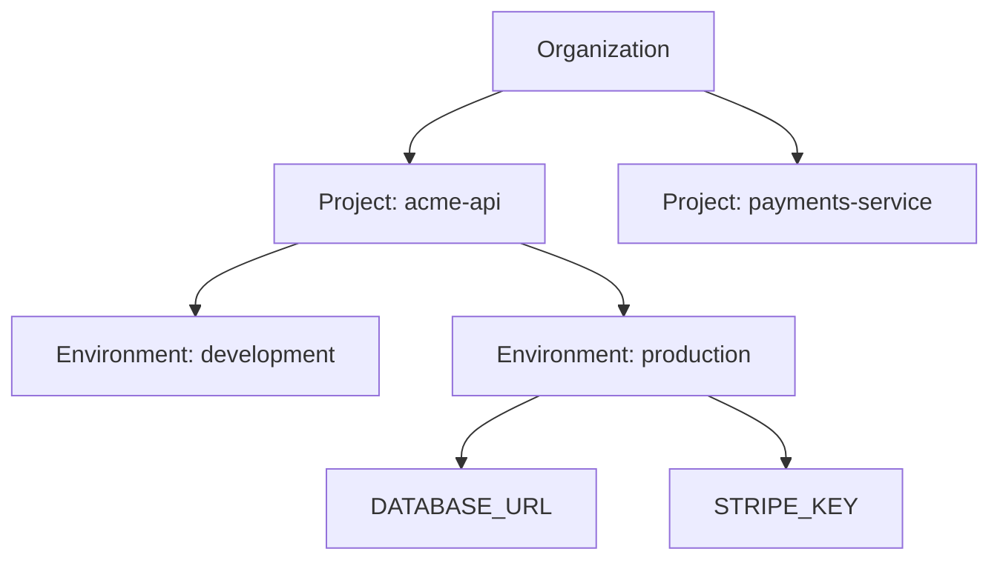

Envi organizes secrets in three layers:



**Organization** — every account gets a personal organization on sign-up. Access grants, memberships, and billing (if you're on the hosted product) all live at this level.

**Project** — a codebase or service. `acme-api`, `payments-service`, `marketing-site` — however you'd naturally split repos.

**Environment** — a named set of secrets within a project: `development`, `staging`, `production`, or whatever you call yours. Each has its own secrets, its own access grants, and its own revision counter for conflict detection.

<Note>
  The web dashboard currently shows one environment per project — it's provisioned automatically the first time you visit a project, so the common case needs no setup. The CLI and API support multiple named environments per project; create additional ones with `envi env create <name>`.
</Note>

## Production is marked explicitly

An environment is either production or it isn't — there's no inference from its name. Mark one on creation:

```bash
envi env create production --production
```

This matters for access: see [Access & Permissions](/concepts/access-and-permissions) for how production-marked environments are treated differently from the rest.

## Revisions and conflict detection

Every environment has a revision counter that increments on every write. `envi push` sends the revision it last saw alongside the new values — if that no longer matches (because someone else pushed in between), the push is rejected instead of silently overwriting their change:

```
stale_revision: remote secrets changed; run envi diff or envi pull
```

This is optimistic concurrency control, the same idea as an HTTP `ETag` — cheap, and it only gets in your way when there's an actual conflict to resolve.
