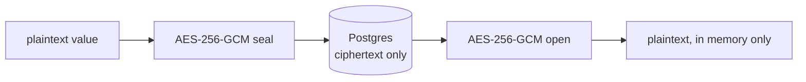

## Encryption at rest

Every secret value is sealed with **AES-256-GCM** before it's written to Postgres — a single encryption key, held only by the API process, never by the database. The database sees ciphertext; it has no way to recover the plaintext on its own.

Decryption happens only in memory, on demand, for a request that has already passed the access-grant check for that environment. A secret is never decrypted "just in case" — only when a specific, authorized read actually needs it.

## Version history

Updating a key doesn't overwrite it — it inserts a new version and repoints the key at it. Nothing is lost:

- Every version is independently encrypted and stored.
- `envi diff` and `envi push` reason about the *current* version, but the history exists for anyone who needs to answer "what was this value before?"
- Deleting a key is a soft delete — it stops appearing in reads, but its history isn't destroyed.

## Every read is audited

Reading a secret's value — via the CLI, the dashboard, or a service token — writes an audit event: who, what, when. See [the audit log](/web-dashboard#activity) in the dashboard, or `envi activity` from the CLI.

<Warning>
  This means secrets are genuinely sensitive to over-fetch: pulling a `.env` file logs a read for every key in it. That's intentional — the audit trail is only useful if it reflects real access, not a sampled approximation of it.
</Warning>

## What the key protects against

AES-256-GCM at rest protects against a very specific threat: **someone with read access to the database, but not the encryption key, cannot recover secret values.** That covers a leaked database backup, a misconfigured read replica, or a compromised database credential that doesn't also expose the API's environment.

It does not protect against a compromised API process itself, or against someone who already has legitimate `read` access to the environment through Envi. For that, see [Access & Permissions](/concepts/access-and-permissions).
