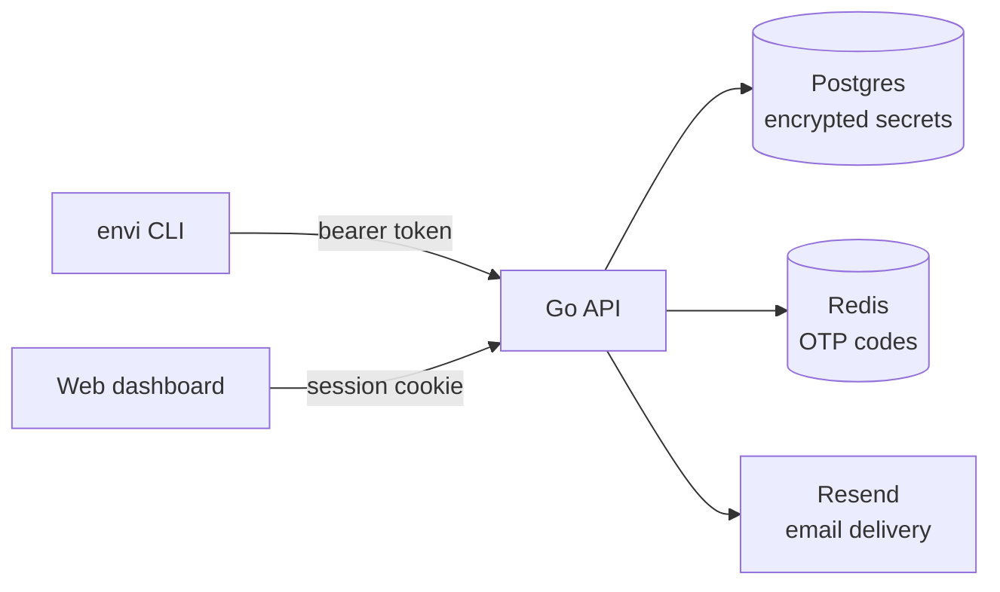

Envi is an environment-secret manager: encrypted `.env` values, scoped access, an audit trail, and a CLI that gets a secret from your database into a running process without anyone typing it into Slack.

The CLI and the web dashboard are two clients of one API — neither is a special case. Pull and push `.env` files from a terminal, or manage the same projects visually. Same backend, same permissions, your choice of interface.

<CardGroup cols={2}>
  <Card title="Install the CLI" icon="terminal" href="/installation">
    One line for Mac, Linux, or Termux. A PowerShell one-liner for Windows.
  </Card>
  <Card title="Quickstart" icon="rocket" href="/quickstart">
    Authenticate, create a project, and push your first `.env` in a few minutes.
  </Card>
  <Card title="CLI reference" icon="square-terminal" href="/cli">
    Every command — `auth`, `push`, `pull`, `diff`, `share`, and the rest.
  </Card>
  <Card title="Self-host it" icon="server" href="/self-hosting/overview">
    Run the entire stack yourself. Nothing is held back for a separate build.
  </Card>
</CardGroup>

## What it does

<AccordionGroup>
  <Accordion title="Encrypted at rest" icon="lock">
    Every secret is sealed with AES-256-GCM before it touches Postgres. Nothing is ever stored in plaintext, including in the version history kept for every change.
  </Accordion>
  <Accordion title="Scoped access" icon="sliders">
    Grant a collaborator `read`, `write`, or `manage` on a project or a single environment. Production doesn't get touched by accident.
  </Accordion>
  <Accordion title="Passwordless auth" icon="id-badge">
    Sign in with a one-time email code, or approve a device from your browser. No passwords exist anywhere in the system to leak.
  </Accordion>
  <Accordion title="Service tokens" icon="robot">
    Long-lived, scoped credentials for CI/CD pipelines and deploy scripts, independent of any human's session.
  </Accordion>
  <Accordion title="Full audit trail" icon="clipboard-list">
    Every read, write, and delete is logged against the org, the actor, and the exact secret touched.
  </Accordion>
  <Accordion title="Email invitations" icon="envelope">
    Invite a teammate by address. They click through, sign in (or sign up on the spot if they're new), and land with access already waiting.
  </Accordion>
</AccordionGroup>

## How it fits together

Secrets are encrypted before they reach Postgres and decrypted only in memory, on demand, for a request that has already passed the access-grant check.

<Note>
  Envi is offered as a hosted product, and this documentation covers the same stack behind it — self-hosting is a first-class option, not a separate "enterprise" build. See [Self-Hosting](/self-hosting/overview) if you'd rather run it yourself.
</Note>
